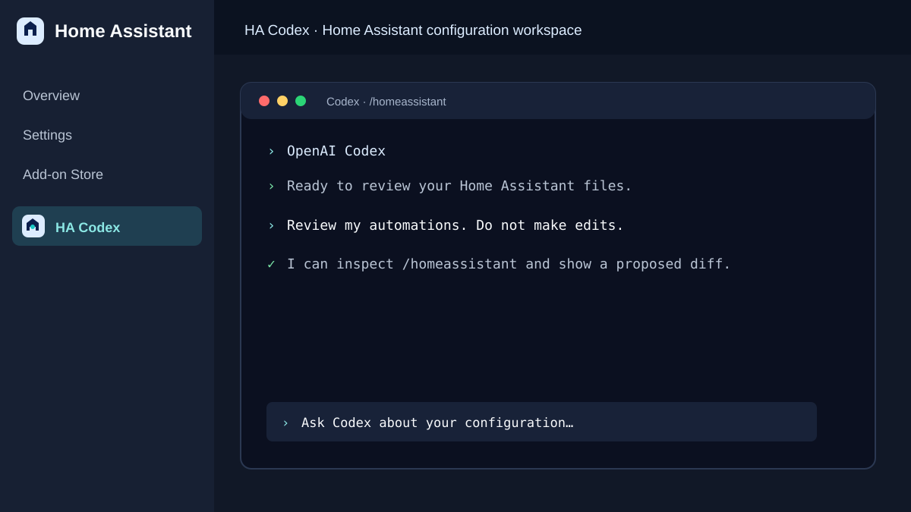
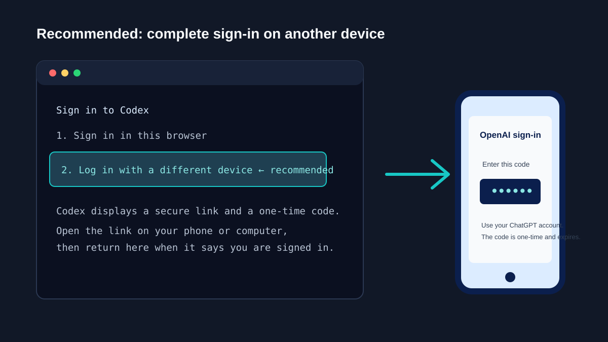

# HA Codex

Run OpenAI Codex in a focused Home Assistant sidebar workspace. HA Codex can
read and edit the files in your Home Assistant configuration directory, making
it useful for reviewing or improving YAML, automations, scripts, dashboards,
packages, and custom components.

> [!CAUTION]
> HA Codex can modify your Home Assistant configuration. Make a Home Assistant
> backup and review every proposed diff before approving a change.



## What it is — and is not

| HA Codex is | HA Codex is not |
| --- | --- |
| A coding workspace with read/write access to `/config` | A replacement for Home Assistant Assist |
| A way to have Codex inspect and propose edits to your files | An unattended administrator that should make changes without review |
| A Home Assistant add-on with a persistent terminal session | A host-level or Docker management tool |

The add-on intentionally has **no** host networking, Docker socket, full host
access, or Home Assistant Supervisor token.

## Install

1. In Home Assistant, go to **Settings → Add-ons → Add-on Store**.
2. Select the three-dot menu → **Repositories**.
3. Add this repository URL:

   ```text
   https://github.com/ambient-home-systems/home-assistant-codex-app
   ```

4. Find **HA Codex**, select **Install**, then **Start** it.
5. Enable **Show in sidebar**, then open **HA Codex** from the sidebar.

## First-time sign-in

On its first launch, Codex will ask you to sign in. Select **Sign in with
ChatGPT** and use a ChatGPT account that has access to Codex. ChatGPT
subscription access and OpenAI API billing are separate.

### 1. Sign in in the current browser

Choose the browser sign-in option and complete the ChatGPT sign-in page that
opens. Use this when the browser you are currently using to reach Home
Assistant is the same one you want to authenticate.

### 2. Log in with a different device — recommended

Choose **Log in with a different device**. Codex will display a secure URL and
a one-time code. Open that URL on a phone, tablet, or another computer, sign in
to your ChatGPT account, enter the code if asked, and return to HA Codex.

This is the preferred option because it avoids browser or pop-up limitations in
Home Assistant’s embedded add-on page. The code is temporary; never share it.



### 3. OpenAI API key (only if your Codex sign-in screen offers it)

An API key is a separate, usage-billed OpenAI Platform account. It does **not**
use your ChatGPT subscription allowance. Prefer the ChatGPT sign-in options
above unless you specifically want API-billed usage. Never paste an API key in
an issue, screenshot, chat, or repository file.

## Model choice

HA Codex defaults to **GPT-5.6 Terra**. It is the recommended balance for
routine Home Assistant reviews, configuration edits, and dashboard work. Use
the add-on's **Configuration** tab to select **GPT-5.6 Sol** only for an
unusually difficult or broad task, then restart the add-on.

## Safe first prompts

Start in review mode:

```text
Review my Home Assistant configuration. Do not make edits. Explain your findings first.
```

Before approving a change:

```text
Show the exact files and diff you propose. Do not restart Home Assistant.
```

For a focused task:

```text
Review automations.yaml for duplicate triggers and risky conditions. Do not change anything yet.
```

## Warnings you may see

### `MCP startup incomplete` or `dataAnalyticsWidgets failed to start`

You may see an MCP warning on startup, such as a `dataAnalyticsWidgets` client
failure. This is an optional Codex plugin/client startup message, not a Home
Assistant or HA Codex failure. If `codex mcp list` reports that no MCP servers
are configured and Codex can read your files, **you can safely ignore it**. It
does not affect normal Codex prompts, terminal commands, or access to your Home
Assistant configuration.

### Sandbox / Bubblewrap warning

HA Codex 0.1.4 and later includes Bubblewrap. Update the add-on if you see an
older sandbox warning. If it remains after updating, restart the add-on once;
normal Codex operation is not blocked by the fallback sandbox message.

## Updates and releases

Every release has three matching records:

- The add-on version in `home_assistant_codex_app/config.yaml`.
- User-facing Home Assistant update notes in `home_assistant_codex_app/CHANGELOG.md`.
- A tagged [GitHub Release](https://github.com/ambient-home-systems/home-assistant-codex-app/releases).

Use the Add-on Store to install updates. Open the update details before
installing to read the changelog.

## Support and privacy

When asking for help, include the add-on version and the exact error text, but
remove access tokens, device codes, API keys, private URLs, and personal
information. Do not post an entire `configuration.yaml` publicly unless you
have reviewed it for secrets.
