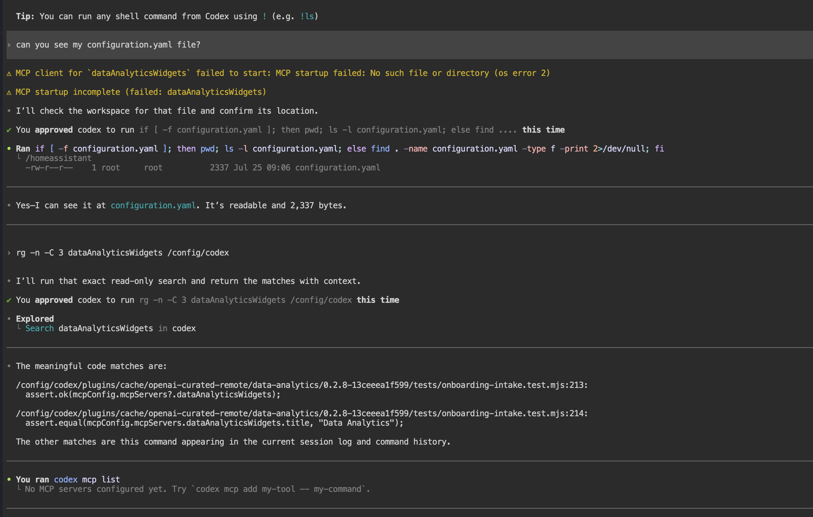

# HA Codex

Run OpenAI Codex in a focused Home Assistant sidebar workspace. HA Codex can
read and edit the files in your Home Assistant configuration directory, making
it useful for reviewing or improving YAML, automations, scripts, dashboards,
packages, and custom components.

> [!CAUTION]
> HA Codex can modify your Home Assistant configuration. Make a Home Assistant
> backup and review every proposed diff before approving a change.

## HA Codex in use

This real, privacy-safe workspace capture shows Codex reading a Home Assistant
configuration file. It also shows the optional MCP warning discussed below;
normal file access and Codex operation continue as expected.



## What it is — and is not

| HA Codex is | HA Codex is not |
| --- | --- |
| A coding workspace with read/write access to `/config` | A replacement for Home Assistant Assist |
| A way to have Codex inspect and propose edits to your files | An unattended administrator that should make changes without review |
| A Home Assistant add-on with a persistent terminal session | A host-level or Docker management tool |

The add-on intentionally has **no** host networking, Docker socket, full host
access, or Home Assistant Supervisor token.

## Install

1. In Home Assistant, go to **Settings → Add-ons → Add-on Store**.
2. Select the three-dot menu → **Repositories**.
3. Add this repository URL:

   ```text
   https://github.com/ambient-home-systems/ha-codex
   ```

4. Find **HA Codex**, select **Install**, then **Start** it.
5. Enable **Show in sidebar**, then open **HA Codex** from the sidebar.

## First-time sign-in

On its first launch, HA Codex shows a two-option sign-in menu. Use a ChatGPT
account that has access to Codex for device-code sign-in; ChatGPT subscription
access and OpenAI API billing are separate. After updating from an earlier
version, restart HA Codex to begin this revised sign-in flow in a fresh session.

### 1. Log in with a different device (Preferred Method)

> [!IMPORTANT]
> **Recommended for most Home Assistant installations**
>
> Choose **Log in with a different device**. Codex will display a secure URL
> and one-time code. Open the URL on a phone, tablet, or another computer,
> sign in to your ChatGPT account, enter the code if asked, then return to HA
> Codex.
>
> This is the preferred option because it avoids browser and pop-up limitations
> in Home Assistant’s embedded add-on page. The code is temporary—never share
> it.

> [!NOTE]
> Device codes are deliberately not shown in public screenshots. Treat the
> temporary URL and code as sign-in credentials and keep them private.

### 2. OpenAI API key (only if your Codex sign-in screen offers it)

An API key is a separate, usage-billed OpenAI Platform account. It does **not**
use your ChatGPT subscription allowance. Prefer the ChatGPT sign-in options
above unless you specifically want API-billed usage. Never paste an API key in
an issue, screenshot, chat, or repository file.

## Model choice

HA Codex defaults to **GPT-5.6 Terra**: the sensible balance for routine Home
Assistant reviews, configuration edits, and dashboard work. The Configuration
tab offers every currently documented Codex CLI model:

| Model | Best use |
| --- | --- |
| **GPT-5.6 Terra** (default) | Everyday Home Assistant work; the best balance of quality, speed, and usage. |
| **GPT-5.6 Sol** | Difficult, ambiguous, high-value work that benefits from more analysis and polish. |
| **GPT-5.6 Luna** | Clear, repeatable, or high-volume work where speed and lower usage matter. |
| **GPT-5.6** | The general GPT-5.6 default model alias. |
| **GPT-5.5** | The prior-generation frontier model. |
| **GPT-5.4** / **GPT-5.4 Mini** | Older general-purpose and lightweight options. |
| **GPT-5.3 Codex Spark** | A text-only, real-time coding preview for ChatGPT Pro accounts. |

The Configuration setting starts Codex with `--model` every time the add-on
starts. It is your durable startup preference. In contrast, `/model` inside
Codex changes the model of the active session immediately. After changing the
add-on setting, restart HA Codex; with session persistence on, this also opens
the matching model-specific terminal session. Account access still controls
which choices will actually run.

## Add-on settings

Open **HA Codex → Configuration** in Home Assistant and select the model you
want before starting HA Codex. Restart the add-on after changing a setting.

| Setting | Default | What it does |
| --- | --- | --- |
| **Model** | GPT-5.6 Terra | The starting model for new Codex sessions. Use Sol only for unusually difficult or broad work. |
| **Terminal font size** | 14 | Changes the terminal text size (10–24). |
| **Terminal scrollback** | 10,000 lines | Sets how much past terminal output is retained (1,000–50,000 lines) in both the browser and persistent terminal session, including output produced immediately after startup. 10,000 is a practical balance. |
| **Terminal theme** | Dark | Selects the terminal color theme. |
| **Session persistence** | On | Keeps the Codex terminal session running while the add-on is active when you leave and return to the sidebar. |
| **Preserve terminal history** | On | Starts Codex in inline transcript mode without an intermediate fullscreen terminal layer, allowing xterm scrollback to work for long reviews. This is recommended. |

### Long reviews and scrolling

With **Preserve terminal history** on, a long review stays in the normal
terminal transcript so the browser can scroll through it. A visible gold
scrollbar at the right edge shows your position in the history: drag its thumb,
scroll with a mouse wheel or trackpad, or swipe inside the terminal on a touch
device. The scrollbar navigates the full configured history buffer. Increase **Terminal
scrollback** to 20,000 only if 10,000 lines is genuinely not enough.

## Safe first prompts

Start in review mode:

```text
Review my Home Assistant configuration. Do not make edits. Explain your findings first.
```

Before approving a change:

```text
Show the exact files and diff you propose. Do not restart Home Assistant.
```

For a focused task:

```text
Review automations.yaml for duplicate triggers and risky conditions. Do not change anything yet.
```

## Warnings you may see

### `MCP startup incomplete` or `dataAnalyticsWidgets failed to start`

You may see an MCP warning on startup, such as a `dataAnalyticsWidgets` client
failure. This is an optional Codex plugin/client startup message, not a Home
Assistant or HA Codex failure. If `codex mcp list` reports that no MCP servers
are configured and Codex can read your files, **you can safely ignore it**. It
does not affect normal Codex prompts, terminal commands, or access to your Home
Assistant configuration.

### Sandbox / Bubblewrap warning

HA Codex 0.1.4 and later includes Bubblewrap. Update the add-on if you see an
older sandbox warning. If it remains after updating, restart the add-on once;
normal Codex operation is not blocked by the fallback sandbox message.

## Updates and releases

Every release has three matching records:

- The add-on version in `home_assistant_codex_app/config.yaml`.
- User-facing Home Assistant update notes in `home_assistant_codex_app/CHANGELOG.md`.
- A tagged [GitHub Release](https://github.com/ambient-home-systems/ha-codex/releases).

Use the Add-on Store to install updates. Open the update details before
installing to read the changelog.

## Support and privacy

When asking for help, include the add-on version and the exact error text, but
remove access tokens, device codes, API keys, private URLs, and personal
information. Do not post an entire `configuration.yaml` publicly unless you
have reviewed it for secrets.
